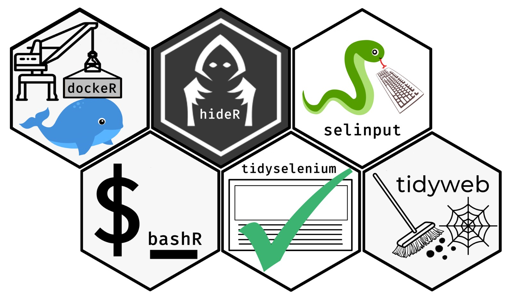

<!-- README.md is generated from README.Rmd. Please edit that file -->

```{r, include = FALSE}
knitr::opts_chunk$set(
  collapse = TRUE,
  comment = "#>",
  fig.path = "man/figures/README-",
  out.width = "100%"
)
```


# tidybrowse 


```{r, echo = FALSE, results='asis', eval = T}

library(badger)

git_repo <- "benjaminguinaudeau/tidybrowse"

cat(
  badge_lifecycle(),
	badge_code_size(git_repo),
	badge_last_commit(git_repo)
)
```


Tidybrowse is a meta package containing different packages easing web scrapping and the deployment of docker containers from R. 

## Examples

A list of use-cases
  
  + [Searching Citations on Google Scholar](example/cleaning_citations.md): Use Selenium to scrape citations from Google Scholar

## Installation

``` r
# install.packages("devtools")
devtools::install_github("benjaminguinaudeau/tidybrowse")
```

## Packages

### [dockeR](https://github.com/benjaminguinaudeau/dockeR)

dockeR wraps up docker command line tools and allows to manage docker containers from R. It can be use to deploy selenium servers, shiny-app servers, rstudio-servers, etc...

### [tidyselenium](https://github.com/benjaminguinaudeau/tidyselenium)

This wraps up RSelenium function in a pipable way. It also offers function to easily communicate with a selenium server running inside a docker container. 

### [tidyweb](https://github.com/benjaminguinaudeau/tidyweb)

Tidyweb allows to represent xml-tree data in a tidy way. It works as well with xml-nodes as with selenium elements. 

### [selinput](https://github.com/benjaminguinaudeau/selinput)

Selinput wraps up the python library pyautogui, which emulates mouse and keyboard input. It allows to easily type, click and scroll inside a docker container, with a running selenium server. 

```{r}
library(tidybrowse)
```


## Thanks

A huge thank you to [Favstats](https://github.com/favstats) for designing each of the hex-stickers. 


