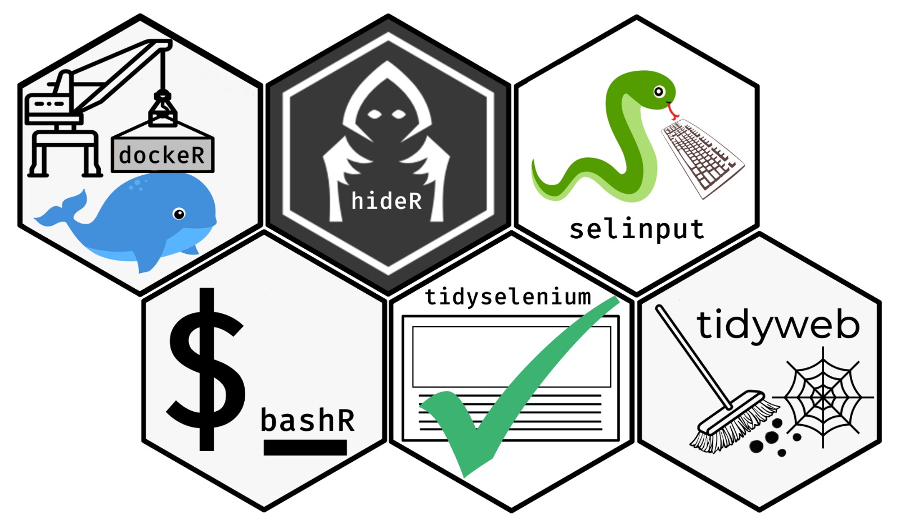

<!-- README.md is generated from README.Rmd. Please edit that file -->

# tidybrowse 

[](https://www.tidyverse.org/lifecycle/#experimental)
[](https://github.com/benjaminguinaudeau/tidybrowse)
[](https://github.com/benjaminguinaudeau/tidybrowse/commits/master)

Tidybrowse is a meta package containing different packages easing web
scrapping and the deployment of docker containers from R.

## Installation

``` r
# install.packages("devtools")
devtools::install_github("benjaminguinaudeau/tidybrowse")
```

## Packages

### dockeR

dockeR wraps up docker command line tools and allows to manage docker
containers from R. It can be use to deploy selenium servers, shiny-app
servers, rstudio-servers, etc…

### tidyselenium

This wraps up RSelenium function in a pipable way. It also offers
function to easily communicate with a selenium server running inside a
docker container.

### tidyweb

Tidyweb allows to represent xml-tree data in a tidy way. It works as
well with xml-nodes as with selenium elements.

### selinput

Selinput wraps up the python library pyautogui, which emulates mouse and
keyboard input. It allows to easily type, click and scroll inside a
docker container, with a running selenium server.

### hideR

hideR provides tool to handle vpn tunnel from R on Mac OS and Linux.

### bashR

bashR allows to run some simple bash functions from whithin R.

``` r
library(tidybrowse)
#> ── Attaching packages ──────────────────────────────────────────────── tidybrowse 0.0.1 ──
#> ✓ RSelenium    1.7.5          ✓ selinput     0.0.0.9000
#> ✓ dockeR       0.1.0          ✓ bashR        0.0.0.9000
#> ✓ tidyselenium 0.0.0.9000     ✓ hideR        0.0.0.9000
#> ✓ tidyweb      0.0.0.9000     ✓ rvest        0.3.5
#> ── Conflicts ─────────────────────────────────────────────────── tidybrowse_conflicts() ──
#> x bashR::append() masks base::append()
#> x bashR::exec()   masks dockeR::exec()
#> x bashR::sudo()   masks dockeR::sudo()
```

## Thanks

A huge thank you to [Favstats](https://github.com/favstats) for
designing each of the hex-stickers.
